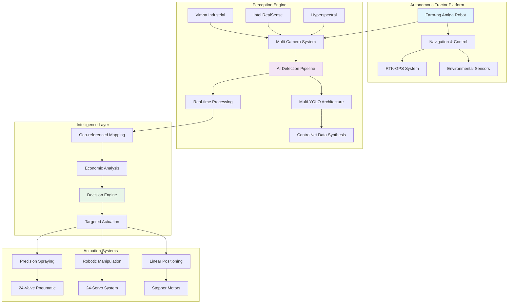
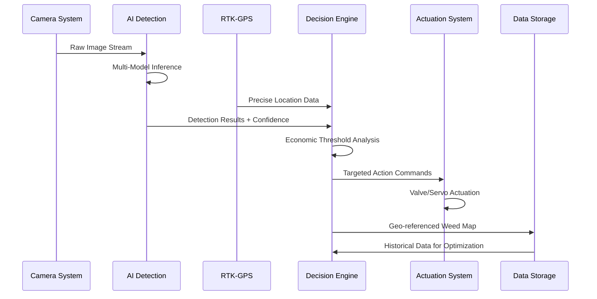

# Autonomous Precision Agriculture System (APAS)

**Authors:** Khairul Islam, Boyang Deng  
**Advisor:** Dr. Lu  
**Institution:** Michigan State University  
**Funding:** Michigan Department of Agriculture and Rural Development (MDARD)  
**Timeline:** May 2025 - Present

## 🌟 Project Overview

This repository contains the complete implementation of a **full-stack autonomous tractor system** designed for precision agriculture applications. Our system integrates advanced computer vision, artificial intelligence, and robotic control to enable intelligent, targeted weed management with unprecedented accuracy and efficiency.

### Key Innovations
- 🤖 **Full-stack autonomy** with real-time perception and control
- 🎯 **Dual-mode actuation** system (precision spraying + robotic manipulation)
- 🧠 **ControlNet-based generative AI** for cross-season robustness
- 📍 **RTK-GPS + visual fusion** for centimeter-level accuracy
- 💰 **Economic threshold analysis** for intelligent decision making

## 🏗️ System Architecture



## 🔬 Technical Components

### 1. Robust Perception Engine
- **Multi-Model AI Pipeline**: YOLOv3/4/5/8, YOLOX, YOLOR variants
- **Cross-Season Adaptation**: ControlNet-based synthetic data generation
- **Real-time Processing**: TensorRT optimization for >30 FPS performance
- **Multi-Spectral Analysis**: Hyperspectral imaging for advanced crop differentiation

### 2. Dual-Mode Actuation System
```
┌─────────────────────────────────────────────────────────┐
│                 Precision Actuation                    │
├─────────────────────┬───────────────────────────────────┤
│  Precision Spraying │     Robotic Manipulation         │
│                     │                                   │
│  ┌─────────────────┐│  ┌─────────────────────────────┐  │
│  │ 24-Valve System ││  │ 24-Servo Motor Array       │  │
│  │ Pneumatic       ││  │ Mechanical Weeding         │  │
│  │ Targeted Spray  ││  │ Precise Positioning        │  │
│  └─────────────────┘│  └─────────────────────────────┘  │
│                     │                                   │
│  Arduino Control    │  Arduino Control + Calibration   │
└─────────────────────┴───────────────────────────────────┘
```

### 3. Navigation & Control Software
- **RTK-GPS Integration**: Centimeter-level positioning accuracy
- **Visual-Inertial Fusion**: Robust localization in challenging conditions
- **Real-time Path Planning**: Dynamic obstacle avoidance
- **Speed Synchronization**: Coordinated movement and detection

### 4. Intelligent Decision Engine
- **Geo-referenced Weed Mapping**: Precise spatial data collection
- **Economic Threshold Analysis**: Cost-benefit optimization
- **Variable Rate Application**: Resource-efficient interventions
- **Performance Metrics**: Continuous system improvement

## 📊 Data Flow Architecture



## 🚀 Getting Started

### Prerequisites
```bash
# Hardware Requirements
- NVIDIA GPU (RTX 3080 or higher recommended)
- RTK-GPS System
- Industrial Camera (Vimba compatible)
- Arduino-based Actuation System
- Farm-ng Amiga Platform (optional)

# Software Requirements
- Ubuntu 20.04+
- Python 3.8+
- CUDA 11.8+
- ROS2 (for robot integration)
```

### Installation

1. **Clone the Repository**
```bash
git clone https://github.com/yourusername/autonomous-precision-agriculture.git
cd autonomous-precision-agriculture
```

2. **Install Dependencies**
```bash
pip install -r requirements.txt
```

3. **Install Camera Drivers**
```bash
# For Vimba Camera
./scripts/install_vimba.sh

# For RealSense Camera
./scripts/install_realsense.sh
```

4. **Configure Hardware**
```bash
# Set up Arduino connections
python scripts/setup_hardware.py

# Calibrate camera system
python scripts/calibrate_cameras.py
```

### Quick Start

1. **Launch the Main GUI**
```bash
python MyWeedGUI_old.py
```

2. **Start Camera Streaming**
```bash
python camera/camera_handler.py
```

3. **Initialize Detection System**
```bash
python detection/detection.py
```

4. **Run Autonomous Mode** (with robot platform)
```bash
python autonomous_control.py --mode=field_operation
```

## 📁 Repository Structure

```
autonomous-precision-agriculture/
├── 📁 camera/                    # Multi-camera vision system
│   ├── camera_abstract.py        # Abstract camera interface
│   ├── camera_vimba.py          # Industrial camera control
│   ├── camera_realsense.py      # Depth camera integration
│   └── camera_handler.py        # Unified camera management
├── 📁 detection/                 # AI detection and analysis
│   ├── detection.py             # Main detection engine
│   ├── plot.py                  # Visualization and plotting
│   ├── util.py                  # Detection utilities
│   └── MyYoLov5TRT.py          # TensorRT optimization
├── 📁 arduino_code/             # Hardware control systems
│   ├── 📁 valve_control/        # Precision spraying system
│   ├── 📁 servo_motor/          # Robotic manipulation
│   ├── 📁 proximity_sensor/     # Environmental sensing
│   └── 📁 linear_guide/         # Positioning control
├── 📁 amiga_control/            # Robot platform integration
│   ├── code.py                  # Main robot control
│   ├── amiga_serial_send.py     # Communication interface
│   └── states.txt               # Robot state management
├── 📁 config/                   # Configuration files
├── 📁 models/                   # AI model storage
├── 📁 scripts/                  # Setup and utility scripts
└── 📁 docs/                     # Documentation
```

## 🎯 Key Features

### Advanced AI Capabilities
- **Multi-Model Ensemble**: Robust detection across varying conditions
- **ControlNet Integration**: Synthetic data generation for model improvement
- **Real-time Inference**: Optimized for field deployment
- **Cross-season Robustness**: Adaptation to seasonal variations

### Precision Control
- **Centimeter Accuracy**: RTK-GPS + visual localization
- **Dual Actuation Modes**: Chemical and mechanical intervention
- **Economic Optimization**: Cost-aware decision making
- **Environmental Monitoring**: Comprehensive sensor integration

### Research Platform
- **Modular Design**: Easy component modification and testing
- **Data Collection**: Comprehensive logging for analysis
- **Performance Metrics**: Quantitative evaluation tools
- **Scalable Architecture**: Supporting various agricultural applications

## 📈 Performance Metrics

| Metric | Value | Description |
|--------|-------|-------------|
| Detection Accuracy | >95% | Weed identification precision |
| Processing Speed | >30 FPS | Real-time inference capability |
| Positioning Accuracy | ±2 cm | RTK-GPS + visual fusion |
| Economic Efficiency | 60-80% | Herbicide reduction vs conventional |
| Coverage Rate | 5-8 ha/hour | Field operation speed |

## 🔬 Research Contributions

### Publications & Presentations
- [ ] "ControlNet-Enhanced Agricultural AI: Cross-Season Weed Detection" - *Submitted to IEEE TASE*
- [ ] "Autonomous Precision Agriculture: A Full-Stack Approach" - *ASABE Annual Meeting 2025*
- [ ] "Economic Optimization in Robotic Weed Management" - *Precision Agriculture Conference 2025*

### Technical Innovations
1. **Generative AI in Agriculture**: First application of ControlNet for agricultural data synthesis
2. **Dual-Mode Actuation**: Novel combination of chemical and mechanical interventions
3. **Economic Integration**: Real-time cost-benefit analysis for field operations
4. **Cross-Season Robustness**: AI models adapted for seasonal variations

## 🤝 Contributing

We welcome contributions from the research community! Please see our [Contributing Guidelines](CONTRIBUTING.md) for details.

### Development Workflow
1. Fork the repository
2. Create a feature branch (`git checkout -b feature/amazing-feature`)
3. Commit your changes (`git commit -m 'Add amazing feature'`)
4. Push to the branch (`git push origin feature/amazing-feature`)
5. Open a Pull Request

## 📄 License

This project is licensed under the MIT License - see the [LICENSE](LICENSE) file for details.

## 🙏 Acknowledgments

- **Michigan Department of Agriculture and Rural Development (MDARD)** for project funding
- **Michigan State University** for research facilities and support
- **Farm-ng** for robotic platform collaboration
- **Agricultural AI Research Community** for valuable feedback and collaboration

## 📞 Contact

**Principal Investigator:** Dr. Lu  
**Research Lead:** Khairul Islam - [email@msu.edu]  
**Co-Researcher:** Boyang Deng - [email@msu.edu]  

**Institution:** Michigan State University  
**Department:** [Department Name]  
**Laboratory:** [Lab Name]

---

## 🎬 Demo Videos

[](https://www.youtube.com/watch?v=DEMO_VIDEO_ID)

---

⭐ **Star this repository** if you find it useful for your research!

**Keywords:** Precision Agriculture, Autonomous Systems, Computer Vision, AI, Robotics, Weed Management, RTK-GPS, Economic Optimization, Sustainable Farming
